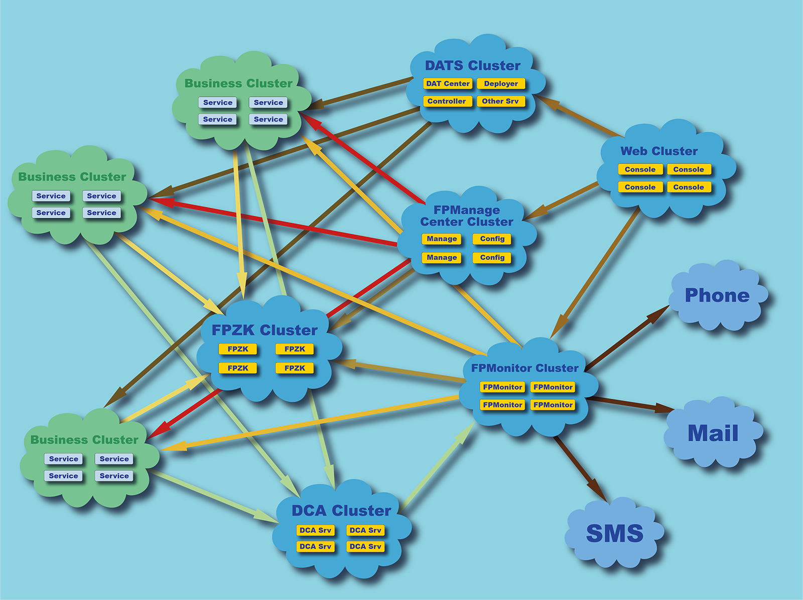
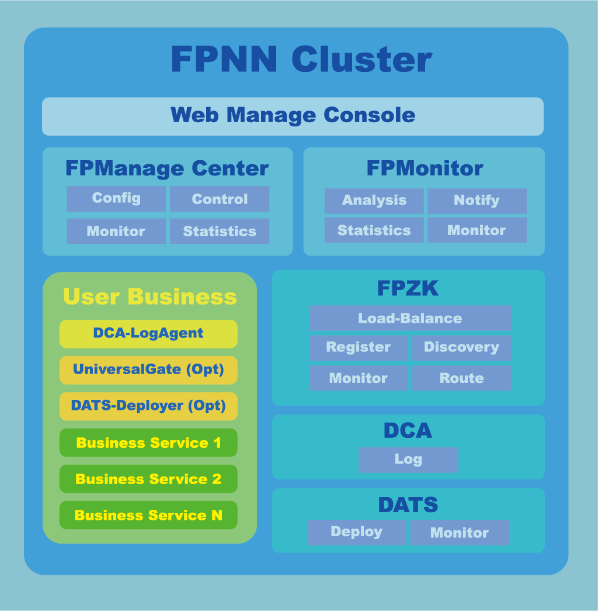
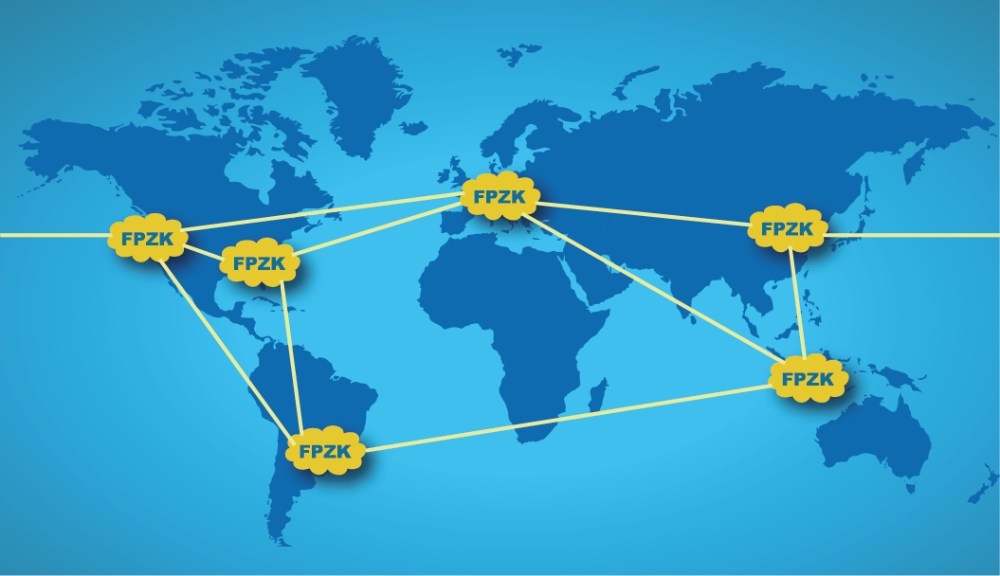
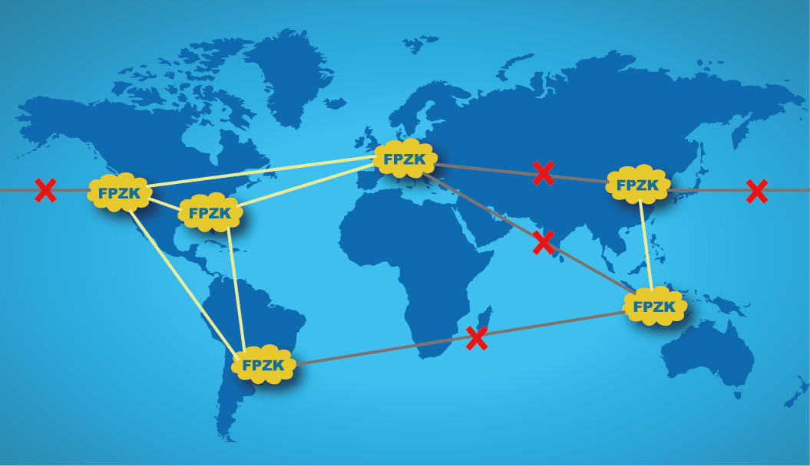
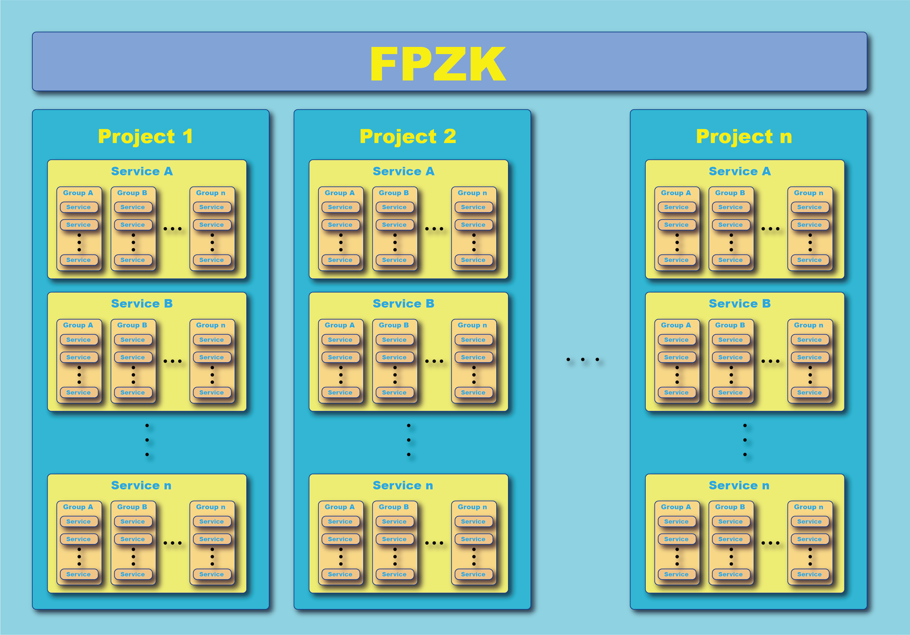

# FPNN 服务治理与服务网格

FPNN 技术生态对服务治理的结构非常清晰，FPNN 的服务治理需要配合 FPNN 技术生态的几个可独立使用的服务，一同完成。

常见的 FPNN 服务治理拓扑如下图所示：

对应的 FPNN 服务治理架构如下图所示：

其中除了 Web Console 集群外，出现了五个 FPNN 技术生态的独立服务：

* **FPManage Center**：FPNN 集群控制管理服务，负责 FPNN 服务各项参数的**动态实时调整**、配置管理、运行监控，和状态统计。

* **FPMonitor**：FPNN 监控分析服务。实时监控、分析和统计所有 FPNN 服务状态，并根据用户自定义规则，进行通知和报警。

* **FPZK**：FPNN 集群管理服务，负责集群管理、服务注册与服务发现、配合 FPZK Client 和 proxy 进行负载均衡，和数据路由。

* **DCA**（Data Collection & Analysis Service）：全球数据采集分析服务。在服务治理中，主要用于数据采集。

* **DATS**（Distributed Automated Testing Suite）：FPNN 分布式自动测试套件。在服务治理中，主要用于分布式自动化测试，亦可用于服务的自动化部署，和服务的监控。

为了进一步深入理解，本文将按以下结构层次，逐项介绍说明：

### **内容目录**

* **服务治理**

	+ 服务的注册与发现
	+ 服务网络的分裂与合并
	+ 数据路由与负载均衡
	+ 服务的安全与访问控制
	+ 服务的分层架构与子集群
	+ 服务的依赖关系
	+ 服务升级、灰度发布与接口兼容
	+ 服务弹性与扩容、缩容
	+ 服务的新增与撤除
	+ 服务降级与熔断
	+ 服务的监控与日志的采集和分析
	+ 服务的版本管理
	+ 服务的部署
	+ 服务的自动化测试
	+ 服务的工程模版与IDE集成

* **服务网格**

## **服务治理 (SOA Governance)**

### **服务的注册与发现**

FPNN 技术生态使用 FPZK 作为集群管理服务。

FPZK 是一个对等分布式集群服务，CAP 采用**可用性优先**策略，牺牲强一致性，而采用**最终一致性**。避免业内之前曾多次出现过的，因投票无法达成一致，而导致线上业务长时间无法提供服务的情况出现。

业务服务程序只需集成 FPZK 客户端模块，便可接入 FPZK 服务，自动上报运行状态、系统负载，自动维护心跳。如果关注/订阅了依赖服务，则当依赖服务发生变动时，FPZK 集群将把依赖服务的变动状态**实时推送**给订阅者。

而当订阅者使用 FPNN 框架自带的 proxy 模块访问依赖服务时，所有依赖服务的变动导致的路由调整和变动，将会由框架自动处理，并对业务透明，业务服务无需关心。

FPNN 框架已经自带了 [FPZK 的客户端模块](../../extends/FPZKClient.h)。

### **服务网络的分裂与合并**

一般的集群管理服务不建议跨机房部署，但 FPZK 集群，有必要时，可以进行跨机房，甚至洲际部署，应对全球化的服务集群管理。

上图为 FPZK 全球部署的一个实例。

如果网络出现异常，比如因为网络蠕虫或者网络攻击导致的洲际光缆拥堵，亚洲与欧美网络被迫断开。如下图所示：

此时亚洲成为孤岛。

对于多数常见的强一致性优先的集群管理服务，亚洲的集群管理服务节点将停止服务（因为自己是少数节点），而要求业务服务去连接因网络异常已无法连接的欧美节点。此时使用常见的强一致性优先的集群管理服务的亚洲服务，将陷入拒绝服务之中，所有亚洲的业务进入瘫痪状态。

但对于 FPZK 服务，此时全球集群将自动退化为欧美、亚洲两个独立集群。两个独立集群仍将正常运转。

当网络异常消失，光缆恢复正常，欧美和亚洲两个独立集群就会自动合并成单一的全球集群。其中一切变动，均对业务透明。

### **数据路由与负载均衡**

配合 FPZK 服务，FPNN 框架自带了4种数据路由与负载均衡方式。

分别是

* 随机策略的负载均衡/路由：[TCPFPZKRandomProxy](../../extends/TCPFPZKRandomProxy.hpp)
* 轮流/轮转策略的负载均衡/路由：[TCPFPZKRotatoryProxy](../../extends/TCPFPZKRotatoryProxy.hpp)
* 一致性哈希策略的负载均衡/路由：[TCPFPZKCarpProxy](../../extends/TCPFPZKCarpProxy.hpp)
* 强一致/广播策略的负载均衡/路由：[TCPFPZKConsistencyProxy](../../extends/TCPFPZKConsistencyProxy.hpp)

业务使用 proxy 如同直接使用 TCPClient，直接调用

	// sync mode
	proxy->sendQuest(interface_name, quest);

	// async mode
	proxy->sendQuest(interface_name, quest, callback);

接口发送数据即可。同时，FPNN 自身提供的 proxy 也支持 server push，因此，proxy 本质上是面对 FPNN 业务集群的**集群客户端**。

### **服务的安全与访问控制**

FPNN 服务的安全与访问控制可以分为四部分：

* FPNN 框架自身提供的安全控制
* Dispatcher 服务提供的访问控制
* UniversalGate 提供的拓扑屏蔽和路由与访问控制
* FPZK 提供的 Token 机制

FPNN 框架自身提供了基于 **ECC/ECDH 的密钥交换机制**和 **AES 加密**机制。FPNN 框架本身可以**强制所有接口**必须加密访问，或者在开放访问的同时，**部分接口**必须加密访问，或者仅内网访问，或者仅能内网加密访问。

同时，FPNN 自身提供白名单功能。启用白名单后，仅白名单内指定的地址，或者 IP 段内的机器，才可以进行访问。

**Dispatcher** 服务在进行负载均衡的同时，对外屏蔽了后端所有细节，只有被允许访问的服务类型才能通过 Dispatcher 获取，并进行访问。

**UniversalGate** 可以作为业务集群的通用网关使用。其不仅包含了 FPNN 框架自身提供的所有安全特性，还在提供代理访问的同时，限定了外界可以对网关内部访问的服务种类，以及路由方式。

**FPZK 集群管理服务**则将业务划分为数个项目，每个项目均可设置不同的 token。如果没有对应的 token，则相应的项目内的所有服务，及服务拓扑，均不可触及。

### **服务的分层架构与子集群**

FPNN 建议将业务划分为多个不同的项目、集群，以此建立服务的分层结构，和模块化集群。

通过合理使用 Dispatcher、UniversalGate 和数据路由与负载均衡的 proxy，业务可独立成数个黑盒模块，以减少不同服务之间的依赖和交互，避免内网连接随服务数量增加而暴增。

此外，FPZK 集群服务配合数据路由 proxy，提供多层次结构管理。

首先，FPZK 将业务划分称为多个不同的项目；然后每个项目下面将会有不同的服务类别；然后每个服务类别还可以进行分组。

而且，不论是项目级别，服务类别级别，还是服务分组级别，都可以很容易地构成一个子集群。再配合 UniversalGate 的合理使用，任意组合的服务都可以很容易地划分为独立的子集群。且各个子集群还能有独立的嵌套和内部层次结构。

### **服务的依赖关系**

通过 DCA 与 FPMonitor、FPManage Center 的配合使用，可通过 FPMonitor 或者 FPManage Center 直接获取到所有服务之间的相互依赖关系。

同时还可以直接获取具体依赖的接口名称、调用次数和访问统计。

### **服务升级、灰度发布与接口兼容**

FPNN 通过类似字典形式的参数封装，配合参数提取接口，解决了接口的兼容性，及参数顺序的问题。

* FPNN 不关心参数顺序
* FPNN 无视不处理的参数
* 通过使用 getXXX(...) 函数，当参数缺失或类型不匹配时，将返回默认值（可自定义）
* 通过使用 wantXXX(...) 函数，当参数缺失或类型不匹配时，将抛出异常。业务不捕获的情况下，框架将自动返回参数异常的相关错误给客户端。

此外，FPNN客户端**“一个 API 解决所有操作”**的特性，决定了 FPNN 无需通过 IDL 生成桩代码，即可着手代码编写，并进行服务开发。

因此 FPNN 技术生态对 IDL 并**无依赖**。一旦接口改动，配合 FPNN 的 getXXX(...) 函数，业务无需同时修改和升级关联的所有服务，且能实现自动兼容，多版本兼容。在此基础上，可实现服务的灰度发布。

### **服务弹性与扩容、缩容**

配合 FPZK 集群管理服务，以及数据路由和负载均衡的 proxy 模块，FPNN 服务在良好的设计下可做到同类型服务，所有实例使用完全相同的配置文件。

在此基础上，配合云主机的弹性服务，可根据业务需求，随时、动态地增加，或者减少服务实例。相关的变动，会经由 FPZK 实时下发到所有的订阅方，订阅方的 proxy 模块将实时做出调整，而无需业务进行处理。

### **服务的新增与撤除**

对于新增服务，配合 FPZK 集群管理服务，按需直接启动新增服务的运行实例即可，无需其他操作。

对于服务的撤除，如果是减少服务实例，可根据 FPMonitor 的监控数据，直接停止相应服务实例即可。

对于完全撤除某类型服务的所有实例，则可通过 FPMonitor，或者目标服务 FPNN 框架自身提供的 *infos 接口，在所有接口访问统计均为 0 后，直接停止相应服务实例即可。

### **服务降级与熔断**

一般情况下，服务降级用于处理访问异常增大，需要停止或者中断非核心服务，以保证核心服务正常运行时采用。

FPNN 框架在 4 核虚拟机上即可应对上百万长链，或者每秒20万以上的请求。配合 FPZK 和云主机的弹性服务，在访问流量异常突增时，无需服务降级，直接追加服务实例即可。

而服务熔断是避免内网雪崩效应的应对手段。通过修改和调整 FPNN 框架最大请求队列长度的配置，在当最大请求队列满后，框架将**自动实行服务熔断**。

所有使用 FPNN 框架开发的服务，均具备自动熔断的功能，包括 UniversalGate 服务。

因此，不仅可以实现服务实例的熔断，也可以直接实现集群的**整体熔断**。

此外，配合 **FPManage Center**，可以直接**启用/关停**任意服务的任意业务接口，或者任意集群的任意业务接口，以便及时终止相关服务，但不影响同属于统一进程的其他接口和服务。

### **服务的监控与日志的采集和分析**

FPNN技术生态采用 DCA（Data Collection & Analysis Service 全球数据采集分析服务）进行日志收集，并配合 FPMonitor 进行监控和分析、统计。

通过 FPMonitor，可直接获取到任意服务的接口统计；通过 FPManage Center，可以直接获取到任意服务、任意类别服务、任意集群的访问信息、访问统计；通过 Web Console 可随时随地地查看当前的服务状态。

此外，FPMonitor 支持自定义报警规则。在规则触发时，可根据条件，进行邮件、短信、或者电话通知。

### **服务的版本管理**

**FPZK 集群管理**服务支持同一服务类别的多版本管理。业务服务在通过 FPZK 客户端订阅依赖服务时，可指定订阅的服务版本。如果订阅时指定版本为空，则订阅该服务类别的所有版本。

因此，通过 FPZK 集群管理服务，可以按需访问和管理同一服务的不同版本。同时，配合服务的灰度发布，可实现 A/B 版本的不同流程与服务依赖。

### **服务的部署**

FPNN 框架和技术生态对服务的部署并无具体要求。可使用第三方自动化部署工具，或者使用 FPNN 技术生态中 DATS（Distributed Automated Testing Suite）的自动分发部署功能。DATS 的自动分发部署功能，可以指定设备，或者逻辑区域同步部署，亦可远程启动指定的服务实例。

### **服务的自动化测试**

FPNN 技术生态提供 DATS（Distributed Automated Testing Suite）分布式自动化测试套件进行自动化的测试。

根据具体的业务，使用 DATS 提供的执行器（Actor）和控制器（Controller）模版编写相应的测试用例，和测试控制流程后，即可通过 DATS 自动分发、部署测试用例，并按照测试控制流程启动、汇报、汇总、分析、和停止测试。同时可以生成实时报表，亦可实时监控测试机和目标机的压力/负载状态、内存使用、网络使用、链接数量、响应时间等状态信息。

### **服务的工程模版与IDE集成**

FPNN 框架是一个分布式微服务框架，在设计之初便将简单易用作为核心指标。因此 FPNN 无论是作为服务端还是客户端，均无需工程模版，寥寥数行代码即可构建出一个 FPNN 应用。因此，亦无需和 IDE 进行集成。

## **服务网格 (Service Mesh)**

**服务网格**主要用于解决原生服务导致的复杂的网络拓扑，其次便是原生服务的服务注册、服务发现、负载均衡、限流、熔断、监控、访问控制等。

具备良好设计的分布式网络无需服务网格多一次数据辗转，但如需使用，请使用 FPNN 技术生态中的 **UniversalGate**。以上功能，全部具备，**无需额外处理**。

[HighRAS]: https://www.ilivedata.com/        "云上曲率"

